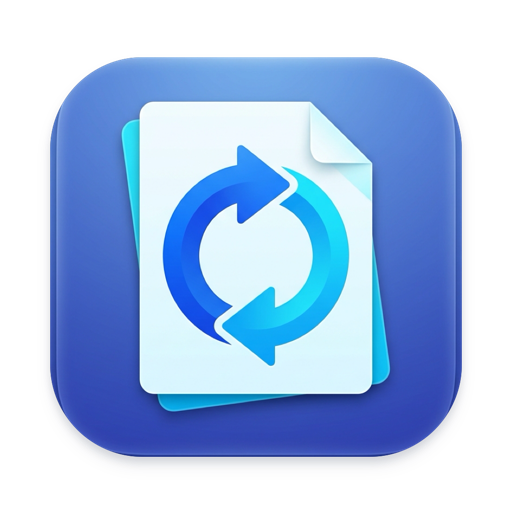

# LocalConvert

<p align="center">
  
</p>

<p align="center">
  <strong>Native macOS application for local, private, and lightning-fast file conversion.</strong><br />
  100% offline on-device processing. No cloud uploads. No external subscriptions. No tracking.
</p>

<p align="center">
  <a href="https://github.com/RighteousLife/LocalConvert/releases/latest">Download Latest Release</a> •
  <a href="#features">Features</a> •
  <a href="#supported-formats">Supported Formats</a> •
  <a href="#installation">Installation</a> •
  <a href="#architecture">Architecture</a> •
  <a href="#licensing">Licensing</a>
</p>

---

## Overview

**LocalConvert** is a native macOS application written in Swift and SwiftUI for converting files across images, office documents, spreadsheets, presentations, PDFs, audio, and video.

Conversions are performed entirely on your local Mac. The application does not contain network clients, upload endpoints, or telemetry for conversion workflows. 

All required conversion runtimes—including **libwebp**, static **FFmpeg & ffprobe**, and headless **LibreOffice**—are bundled within the application distribution. End users do not need Homebrew, Python, or command-line utilities installed on their system.

---

## Download

Get the official Release DMG for Apple Silicon Macs:

- 📦 **[Download LocalConvert 1.0.0 (Apple Silicon DMG)](https://github.com/RighteousLife/LocalConvert/releases/download/v1.0.0/LocalConvert-1.0.0-arm64.dmg)**
- 🔒 **[SHA256 Checksums](https://github.com/RighteousLife/LocalConvert/releases/download/v1.0.0/SHA256SUMS.txt)**

---

## Features

- **Images & Compression**: Convert between PNG, JPG, WebP, HEIC, TIFF, BMP, GIF, AVIF, SVG, and ICNS. Features lossy/lossless WebP tuning, target size bounding (e.g. Discord 25MB), resizing, and cropping.
- **PDF Toolbox**: Merge PDFs, Split pages, Extract specific page ranges, Delete pages, Reorder pages, Rotate pages, and convert Images to PDF.
- **Office & Documents**: High-fidelity conversion of DOCX, XLSX, PPTX, DOC, XLS, PPT, ODT, ODS, ODP, RTF, CSV, and HTML to PDF, plus PDF to Word/PowerPoint/Excel.
- **Audio & Video**: Convert and transcode MP4, MOV, MKV, WebM, AVI, MP3, WAV, FLAC, M4A, AAC, OGG, OPUS, and AIFF. Supports Apple VideoToolbox hardware acceleration and audio extraction.
- **Metadata Editor**: View, edit, and strip EXIF, IPTC, TIFF, QuickTime, ID3, and PDF metadata tags for privacy.
- **Batch Processing & Jobs Center**: Convert multiple files in parallel with configurable concurrency limits, live progress indicators, before/after size comparisons, and retry support.
- **Conversion History**: Searchable history with category filters, source file repeat actions, and technical error logs.
- **Finder Integration**: Right-click any file in Finder → Quick Actions / Services → Convert with LocalConvert. Drag and drop folders to recursively discover supported files.
- **Privacy & Diagnostics**: Diagnostic logs folder management and regex-sanitized error reporting preventing credential or password leakage.

---

## Supported Formats

| Category | Input Formats | Output Formats | Processing Engine |
|---|---|---|---|
| **Images** | PNG, JPG/JPEG, WEBP, HEIC, TIFF, BMP, GIF, AVIF, SVG, ICNS, RAW/DNG | PNG, JPG/JPEG, WEBP, HEIC, TIFF, BMP, GIF, AVIF, PDF, ICNS | Native ImageIO / libwebp |
| **PDF Tools** | PDF, PNG, JPG, TIFF, WebP, HEIC | PDF, PNG, JPG, TIFF, DOCX, PPTX, XLSX | PDFKit / PDFToolboxEngine / LibreOffice |
| **Office & Docs** | DOCX, DOC, XLSX, XLS, PPTX, PPT, ODT, ODS, ODP, RTF, CSV, TSV, HTML | PDF, DOCX, XLSX, PPTX, CSV, TSV | Bundled LibreOffice sandbox / Native Text Engine |
| **Audio** | MP3, WAV, FLAC, M4A, AAC, OGG, OPUS, AIFF | MP3, WAV, FLAC, M4A, AAC, OGG, OPUS, AIFF | Bundled FFmpeg 9.0.2 static binary |
| **Video** | MP4, MOV, MKV, WEBM, AVI, WMV, M4V | MP4, MOV, MKV, WEBM, AVI, WMV, GIF, MP3, WAV, FLAC, M4A | Bundled FFmpeg 9.0.2 / Apple VideoToolbox |

---

## Installation

### System Requirements
- **Hardware**: Apple Silicon Mac (M1, M2, M3, M4 or later)
- **Architecture**: `arm64` (Intel Macs are not supported)
- **Operating System**: macOS 15.0 (Sequoia) or later
- **Dependencies**: None (self-contained DMG)

### Setup Instructions
1. Download **`LocalConvert-1.0.0-arm64.dmg`** from [Releases](https://github.com/RighteousLife/LocalConvert/releases/latest).
2. Open the downloaded DMG.
3. Drag **LocalConvert** into your **Applications** folder.
4. Launch **LocalConvert** from Applications or Spotlight.

> [!NOTE]
> LocalConvert is an open-source **ad-hoc signed, non-notarized** application distributed directly via GitHub Releases. It is **not notarized by Apple**, so macOS may require a manual first-launch approval.
>
> If macOS blocks the first launch:
> 1. Right-click (or Control-click) **LocalConvert.app** in Applications.
> 2. Choose **Open**.
> 3. Confirm **Open** in the macOS security dialog.
>
> This is expected for the current open-source distribution model. This release should **not** be described as Apple-notarized or Gatekeeper-approved.

---

## Keyboard Shortcuts

| Shortcut | Action |
|---|---|
| `⌘O` | Add Files... |
| `⌘↩` | Start Conversion |
| `Esc` | Cancel Active Conversion |
| `⌘⇧R` | Repeat Last Conversion |
| `⌘1` | Switch to Convert Tab |
| `⌘2` | Switch to Jobs Center |
| `⌘3` | Switch to PDF Toolbox |
| `⌘4` | Switch to Metadata Editor |
| `⌘5` | Switch to Presets |
| `⌘6` | Switch to History |
| `⌘,` | Open Settings |
| `⌘Q` | Quit LocalConvert |

---

## Building from Source

### Prerequisites
- macOS 15.0+ with Xcode 16.0+ (Command Line Tools installed)
- [XcodeGen](https://github.com/yonaskolb/XcodeGen) (`brew install xcodegen`)

### Build & Run
```bash
# 1. Clone repository
git clone https://github.com/RighteousLife/LocalConvert.git
cd LocalConvert

# 2. Verify bundled runtimes and dynamic libraries
./scripts/verify-dependencies.sh

# 3. Generate Xcode project
xcodegen generate

# 4. Run test suite
xcodebuild test \
  -project LocalConvert.xcodeproj \
  -scheme LocalConvert \
  -destination 'platform=macOS,arch=arm64'

# 5. Build Release configuration
xcodebuild -project LocalConvert.xcodeproj \
  -scheme LocalConvert \
  -configuration Release \
  -destination 'platform=macOS,arch=arm64' build
```

---

## Architecture & Security

- **Process Isolation**: External subprocesses (LibreOffice, FFmpeg) run within ephemeral sandboxed directories (`/tmp/LocalConvert-*`) that are purged immediately upon completion or cancellation.
- **Credential Sanitization**: The internal `ErrorDetailsFormatter` sanitizes all error output, redacting passwords and sensitive tokens before writing to clipboard, history, or logs.
- **Zero Homebrew Runtime Dependencies**: Bundled static binaries and dynamic libraries ensure total portability and zero system pollution.

---

## Licensing

LocalConvert application source code is licensed under the [MIT License](LICENSE).

### Third-Party Software Acknowledgements
LocalConvert bundles and interacts with third-party open-source components governed by their respective licenses:
- **libwebp & libsharpyuv** (Google LLC) — BSD 3-Clause License
- **FFmpeg & ffprobe** (FFmpeg Project) — LGPLv3+ with Apple VideoToolbox
- **LibreOffice** (The Document Foundation) — Mozilla Public License 2.0 (MPLv2)

For complete license texts, build flags, and attributions, see [THIRD_PARTY_NOTICES.md](THIRD_PARTY_NOTICES.md).
